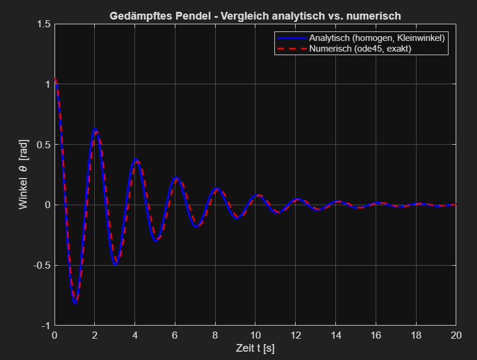
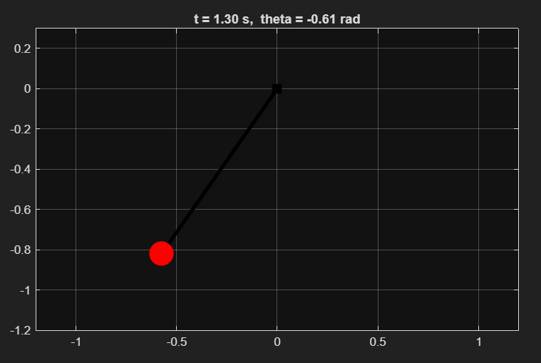

# Lineare Gewöhnliche Differentialgleichungen – MATLAB Simulationen

**ETH Zürich – Elektrotechnik und Informationstechnologie (ITET)**  
Begleitprojekt zur Vorlesung *Analysis 1 & 2* (Ziltener)

---

## Übersicht

Dieses Repository enthält MATLAB-Simulationen zu **linearen gewöhnlichen Differentialgleichungen (GDG)** zweiter Ordnung mit direktem Bezug zur Mechanik und Elektrotechnik. Die Projekte visualisieren den Unterschied zwischen analytischer und numerischer Lösung und machen die verschiedenen Dämpfungsfälle direkt sichtbar.

| Projekt | Typ | DGL |
|---|---|---|
| `pendel_sim.m` | Homogen (freie Schwingung) | Gedämpftes Pendel |
| `schwingkreis_sim.m` | Inhomogen (erzwungene Schwingung) | RLC-Schwingkreis *(coming soon)* |

---

## Theorie: Lineare GDG 2. Ordnung

### Definition

Eine **gewöhnliche Differentialgleichung (GDG)** der Ordnung $n$ für eine Funktion $u: I \to \mathbb{R}$ ist eine Gleichung der Form:

$$\varphi\big(t,\, u(t),\, \dot{u}(t),\, \ldots,\, u^{(n)}(t)\big) = 0, \quad t \in I$$

Eine GDG heisst **linear**, wenn sie die Form

$$u^{(n)} + a_{n-1}(t)\,u^{(n-1)} + \cdots + a_1(t)\,\dot{u} + a_0(t)\,u = f(t)$$

hat. Sie heisst **homogen**, wenn $f(t) = 0$, und **inhomogen**, wenn $f(t) \neq 0$.

### Die vollständige Lösung

Die allgemeine Lösung einer inhomogenen linearen GDG setzt sich immer aus zwei Teilen zusammen:

$$u(t) = \underbrace{u_{\text{hom}}(t)}_{\text{klingt ab}} + \underbrace{u_{\text{part}}(t)}_{\text{bleibt bestehen}}$$

- **Homogene Lösung** $u_{\text{hom}}$: Lösung der GDG mit rechter Seite = 0. Sie beschreibt das transiente Verhalten (Einschwingvorgang) und klingt bei Dämpfung ab.
- **Partikuläre Lösung** $u_{\text{part}}$: Eine spezielle Lösung der inhomogenen GDG. Sie beschreibt das stationäre (erzwungene) Verhalten.

---

## Projekt 1: Gedämpftes Pendel (`pendel_sim.m`)

<p>
  
  
</p>

### Physikalisches Modell

Das Pendel der Masse $m$, Länge $L$ in einem Medium mit Dämpfungskonstante $b$ folgt aus dem zweiten Newtonschen Gesetz und dem Stokesschen Reibungsgesetz:

$$m L^2 \ddot{\theta} + b L^2 \dot{\theta} + mgL\sin(\theta) = 0$$

Dividiert durch $mL^2$:

$$\ddot{\theta} + \frac{b}{m}\dot{\theta} + \frac{g}{L}\sin(\theta) = 0$$

Dies ist eine **nichtlineare** homogene GDG wegen des $\sin(\theta)$-Terms.

### Kleinwinkel-Näherung (Linearisierung)

Für kleine Winkel gilt $\sin(\theta) \approx \theta$, womit die GDG **linear** wird:

$$\ddot{\theta} + \frac{b}{m}\dot{\theta} + \frac{g}{L}\theta = 0$$

Rechte Seite = 0 → **homogene** lineare GDG zweiter Ordnung. Dies erlaubt eine geschlossene analytische Lösung über den Ansatz $\theta(t) = e^{\lambda t}$, der auf das **charakteristische Polynom** führt:

$$\lambda^2 + \frac{b}{m}\lambda + \frac{g}{L} = 0$$

wobei $\delta = \frac{b}{2m}$ die Dämpfungskonstante und $\omega_0 = \sqrt{\frac{g}{L}}$ die Eigenfrequenz ist.

### Die drei Dämpfungsfälle

Das Vorzeichen der Diskriminante $\delta^2 - \omega_0^2$ bestimmt das qualitative Verhalten:

#### 1. Unterdämpfung: $\delta < \omega_0$

Die Wurzeln $\lambda_{1,2}$ sind **komplex**, was zu einer gedämpften Schwingung führt. Die gedämpfte Eigenfrequenz ist:

$$\omega_D = \sqrt{\omega_0^2 - \delta^2}$$

Die analytische Lösung lautet:

$$\theta(t) = e^{-\delta t}\big(A\cos(\omega_D t) + B\sin(\omega_D t)\big)$$

Das Pendel schwingt mit abnehmender Amplitude aus. $A$ und $B$ werden aus den Anfangsbedingungen bestimmt:

$$A = \theta_0, \qquad B = \frac{\dot{\theta}_0 + \delta\theta_0}{\omega_D}$$

#### 2. Kritische Dämpfung: $\delta = \omega_0$

Die Diskriminante ist null, es gibt eine **doppelte reelle Wurzel** $\lambda = -\delta$. Die Lösungsformel ändert sich grundlegend:

$$\theta(t) = (A + Bt)\,e^{-\delta t}$$

Das Pendel kehrt **so schnell wie möglich** in die Ruhelage zurück, ohne zu schwingen. Dies ist der Übergangsfall zwischen Schwingung und kriechender Rückkehr.

> **Achtung im Code:** Bei $\omega_D = 0$ gibt es eine Division durch null in der Formel für $B$ der Unterdämpfung. Ein `if`-Sonderfall ist notwendig.

#### 3. Überdämpfung: $\delta > \omega_0$

Mit $\mu := \sqrt{\delta^2 - \omega_0^2}$ sind die Wurzeln zwei negative reelle Zahlen. Die Lösung ist eine Summe zweier Exponentialfunktionen:

$$\theta(t) = A\, e^{(-\delta+\mu)t} + B\, e^{(-\delta-\mu)t}$$

Das Pendel kriecht langsam in die Ruhelage, kein Schwingen. Langsamer als kritische Dämpfung.

### Analytisch vs. Numerisch

| Eigenschaft | Analytische Lösung | Numerische Lösung (ode45) |
|---|---|---|
| Gleichung | Linearisiert ($\sin\theta \approx \theta$) | Exakt ($\sin\theta$) |
| Gültigkeitsbereich | Nur kleine Winkel | Beliebige Winkel |
| Antriebskräfte | Nur bestimmte Formen | Beliebige Funktionen |
| Genauigkeit | Exakt (für das genäherte Modell) | Numerisch (sehr genau) |

Für kleine Startwinkel (z.B. $\theta_0 = 30°$) stimmen beide Lösungen sehr gut überein. Bei grossen Winkeln (z.B. $\theta_0 = 60°+$) weichen sie merklich ab – der Visualisierungseffekt macht die Grenzen der Kleinwinkel-Näherung direkt sichtbar.

### Numerische Methode: Zustandsraumdarstellung

`ode45` löst nur DGLs erster Ordnung der Form $\dot{z} = f(t, z)$. Die DGL zweiter Ordnung wird daher in zwei gekoppelte DGLs erster Ordnung umgeschrieben:

$$z_1 = \theta, \quad z_2 = \dot{\theta}$$

$$\dot{z}_1 = z_2$$
$$\dot{z}_2 = -\frac{b}{m}z_2 - \frac{g}{L}\sin(z_1)$$

Dies ist das Prinzip der **Zustandsraumdarstellung**, das in der Regelungstechnik und Elektrotechnik zentral ist. Allgemein lässt sich jede GDG $n$-ter Ordnung in $n$ gekoppelte GDGs erster Ordnung umschreiben.

### Parameter und physikalische Analogie

| Grösse | Pendel | RLC-Schwingkreis |
|---|---|---|
| Auslenkung | $\theta(t)$ [rad] | $Q(t)$ [C] |
| Trägheit | $m$ – Masse [kg] | $L$ – Induktivität [H] |
| Dämpfung | $b$ – Reibungskoeffizient [kg/s] | $R$ – Widerstand [Ω] |
| Rückstellgrösse | $g/L$ – Pendellänge/-gravitation | $1/(LC)$ – Kapazität [F] |
| Dämpfungskonstante | $\delta = b/(2m)$ | $\delta = R/(2L)$ |
| Eigenfrequenz | $\omega_0 = \sqrt{g/L}$ | $\omega_0 = 1/\sqrt{LC}$ |
| Antrieb | frei, keine Antriebskraft | Spannung $U_0\cos(\Omega t)$ |

---

## Projekt 2: RLC-Schwingkreis *(coming soon)*

Dieses Projekt simuliert einen **Reihenschwingkreis** (Widerstand $R$, Induktivität $L$, Kondensator $C$) mit einer angelegten Wechselspannungsquelle $U(t) = U_0\cos(\Omega t)$.

Die zugehörige GDG für die **Ladung** $Q(t)$ am Kondensator ist **inhomogen** (aus der Maschenregel):

$$\ddot{Q} + \frac{R}{L}\dot{Q} + \frac{1}{LC}Q = \frac{U_0}{L}\cos(\Omega t)$$

Die Stromstärke ergibt sich dann als $I = \dot{Q}$. Dies ist dieselbe mathematische Struktur wie beim Pendel – mit rechter Seite $\neq 0$. Die vollständige Lösung ist:

$$Q(t) = Q_{\text{hom}}(t) + Q_{\text{part}}(t)$$

Das Projekt zeigt insbesondere das Phänomen der **Resonanz** bei $\Omega = \omega_0 = \frac{1}{\sqrt{LC}}$, wo die Amplitude der partikulären Lösung maximal wird.

---

## Verwendung

```matlab
% Parameter anpassen
m = 1.0;       % Masse [kg]
L = 1.0;       % Länge [m]
b = 0.5;       % Dämpfung — probiere: 0 (ungedämpft), klein (unterdämpft),
               %            2*m*sqrt(g/L) (kritisch), gross (überdämpft)
theta0  = pi/6;   % Startwinkel [rad]
dtheta0 = 0;      % Startgeschwindigkeit [rad/s]

% Script ausführen
run('pendel_sim.m')
```

## Voraussetzungen

- MATLAB (getestet mit R2025b)
